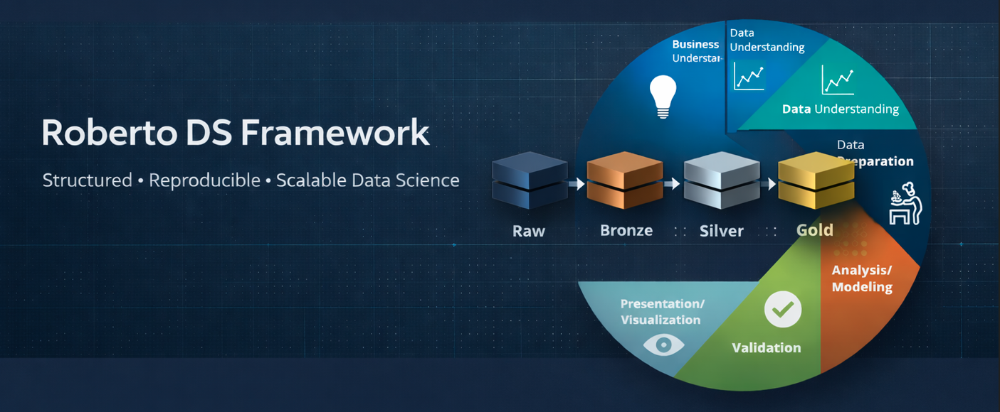

# 🧠 Roberto DS Framework (RDSF)

### Professional CRISP-DM Data Science Architecture Template


 

---

## 🎯 Propósito

Este repositório é um **template estruturado para projetos de Ciência de Dados**, combinando:

- Framework **CRISP-DM**

- Organização em camadas **Raw → Bronze → Silver → Gold**

- Separação clara entre:
  
  - Dados
  
  - Notebooks
  
  - Código fonte (`src/`)
  
  - Modelos
  
  - Artefatos
  
  - Submissões

O objetivo é permitir:

- Reprodutibilidade

- Evolução progressiva (Notebook → src/)

- Organização profissional

- Narrativa clara para portfólio e ambientes corporativos

---

# 🧠 Filosofia do Template

Este template segue três princípios:

### 1️⃣ Método antes de código

Cada projeto é guiado por CRISP-DM, com notebooks organizados por fase.

### 2️⃣ Artefatos explícitos

Cada fase gera outputs documentados que alimentam a próxima etapa.

### 3️⃣ Evolução progressiva

O projeto pode começar simples (notebook-only) e evoluir para estrutura profissional com `src/`.

---

# 📂 Estrutura do Projeto

```text
00_data/
  00_raw/
  01_bronze/
  02_silver/
  03_gold/

01_skills/
  (instruções CRISP-DM em .md)

02_notebooks/
  00_project_index.ipynb
  01_business_data_understanding.ipynb
  02_data_preparation_abt.ipynb
  03_modeling_validation.ipynb
  04_operationalization_submission.ipynb

03_src/
  (código reutilizável – opcional no início)

04_models/
  best_model.pkl

05_artifacts/
  00_config/params.json
  01/
  02/
  03/
  04/

06_submissions/
  submission.csv
```

---

# 🔁 Fluxo de Trabalho

## 🔹 Notebook 00 — Project Index

Hub do projeto com:

- Links para fases

- Checklist (Gates)

- Registro de métricas

---

## 🔹 Notebook 01 — Business + Data Understanding

Entregáveis:

- Problem Statement

- Definição de métricas

- Baseline

- Data Quality Report

- Achados do EDA

Outputs:

```text
artifacts/01/
```

---

## 🔹 Notebook 02 — Data Preparation

Entregáveis:

- Feature Engineering

- ABT (Analytical Base Table)

- Manifest de features

Outputs:

```text
data/03_gold/abt_train.parquet
artifacts/02/features_manifest.json
```

---

## 🔹 Notebook 03 — Modeling + Validation

Entregáveis:

- Benchmark com Stratified CV

- GridSearch (quando aplicável)

- Escolha do modelo campeão

- Validação técnica

Outputs:

```text
artifacts/03/benchmark.csv
models/best_model.pkl
```

---

## 🔹 Notebook 04 — Operationalization

Entregáveis:

- Persistência do modelo

- Inferência

- Submission (Kaggle ou produção)

- Model Card

Outputs:

```text
models/best_model.pkl
submissions/submission.csv
artifacts/04/model_card.md
```

---

# ⚙️ Configuração Central

Arquivo:

```text
artifacts/00_config/params.json
```

Contém:

- Target

- Métrica principal

- Random state

- Caminhos padrão

- Número de folds CV

Isso garante consistência entre fases.

---

# 🏗 Caminho Progressivo (Evolução Recomendada)

### Fase 1 — Notebook-Only

Tudo implementado dentro dos notebooks.

### Fase 2 — Modularização Parcial

Mover funções repetidas para:

```text
03_src/
  data_loader.py
  features.py
  modeling.py
  evaluation.py
```

### Fase 3 — Arquitetura Profissional

- Notebooks tornam-se apenas orquestradores

- Lógica principal vive em `src/`

- Preparação para deploy real

---

# 📊 Quando Usar Este Template

- Projetos Kaggle

- Projetos de portfólio

- Casos simulados de negócio

- Provas técnicas

- Projetos internos corporativos

---

# 🧩 Diferenciais

✔ Estrutura clara e padronizada  
✔ Separação entre dados e modelagem  
✔ Gates por fase  
✔ Fácil versionamento  
✔ Escalável para produção  
✔ Excelente narrativa para portfólio

---

# 🚀 Como Criar um Novo Projeto

1. Clique em **Use this template** no GitHub

2. Ajuste `params.json`

3. Coloque dados em `00_data/00_raw/`

4. Siga a ordem dos notebooks

---

# 📌 Próximos Passos Sugeridos

- Adicionar versionamento de experimentos

- Integrar com MLflow

- Criar CLI para rodar fases automaticamente

- Adicionar Docker

- Adicionar testes unitários no `src/`

---

## 🎯 Why This Template Matters

This template demonstrates:

- Structured problem-solving using CRISP-DM

- Explicit artifact contracts between phases

- Reproducible environments (uv)

- Cross-over between Data Science and Data Engineering

- Progressive evolution from notebook to production-ready architecture

It reflects professional-level organization, scalability, and deployment awareness — not just model experimentation.

---

## 🏗 Professional Positioning

This project is designed to simulate real-world data science delivery:

✔ Clear phase separation  
✔ Artifact versioning  
✔ Validation rigor (Stratified CV + GridSearch)  
✔ Model persistence and inference pipeline  
✔ Scalable architecture ready for src/ evolution

# 👤 Autor

Roberto Soares  
Data Engineering | Data Science | Developer Experience

---

---fi/
