# 🧠 Roberto DS Framework (RDSF)

### Professional CRISP-DM Data Science Architecture Template


---

## 🎯 Propósito

Este repositório é um **template estruturado para projetos de Ciência de Dados**, combinando:

- Framework **CRISP-DM**

- Organização em camadas **Raw → Bronze → Silver → Gold**

- Separação clara entre:
  
  - Dados
  
  - Notebooks
  
  - Código fonte (`src/`)
  
  - Modelos
  
  - Artefatos
  
  - Submissões

O objetivo é permitir:

- Reprodutibilidade

- Evolução progressiva (Notebook → src/)

- Organização profissional

- Narrativa clara para portfólio e ambientes corporativos

---

# 🧠 Filosofia do Template

Este template segue três princípios:

### 1️⃣ Método antes de código

Cada projeto é guiado por CRISP-DM, com notebooks organizados por fase.

### 2️⃣ Artefatos explícitos

Cada fase gera outputs documentados que alimentam a próxima etapa.

### 3️⃣ Evolução progressiva

O projeto pode começar simples (notebook-only) e evoluir para estrutura profissional com `src/`.

---

# 📂 Estrutura do Projeto

```text
00_data/
  00_raw/
  01_bronze/
  02_silver/
  03_gold/

01_skills/
  (instruções CRISP-DM em .md)

02_notebooks/
  00_project_index.ipynb
  01_business_data_understanding.ipynb
  02_data_preparation_abt.ipynb
  03_modeling_validation.ipynb
  04_operationalization_submission.ipynb

03_src/
  (código reutilizável – opcional no início)

04_models/
  best_model.pkl

05_artifacts/
  00_config/params.json
  01/
  02/
  03/
  04/

06_submissions/
  submission.csv
```

---

## 🧱 Arquitetura Conceitual

Este template organiza um projeto de Ciência de Dados como um **fluxo CRISP-DM com contratos de artefatos**, permitindo reprodutibilidade e evolução progressiva (Notebook → `src/`).

### Visão em Camadas (Dados)

- **00_raw**: dados originais, sem alterações (fonte)
- **01_bronze**: ingestão e padronização mínima (tipos/colunas)
- **02_silver**: dados limpos, consistentes, prontos para análise
- **03_gold**: **ABT** (Analytical Base Table) / dataset final de modelagem

### Visão em Fases (CRISP-DM)

- **Notebook 01**: Business + Data Understanding (EDA + Qualidade)
- **Notebook 02**: Data Preparation (Feature Engineering + ABT)
- **Notebook 03**: Modeling + Validation (CV + GridSearch + decisão)
- **Notebook 04**: Operationalization (modelo salvo + inferência + submission)

### Contratos de Artefatos

Cada fase produz **outputs explícitos** em `05_artifacts/` (e/ou `03_gold`) que alimentam a fase seguinte.  
Isso reduz retrabalho, evita divergências e facilita auditoria do processo.

> **Evolução progressiva:** no início, a lógica pode viver nos notebooks. Com maturidade, funções repetidas migram para `03_src/`, e os notebooks viram orquestradores.

---

### Diagrama de Arquitetura (CRISP-DM + Artefatos)

```mermaid
flowchart TB

A["00_data/00_raw - Dados originais"] --> B["00_data/01_bronze - Ingestão mínima"]
B --> C["00_data/02_silver - Limpeza + consistência"]
C --> D["00_data/03_gold - ABT / Dataset de modelagem"]

subgraph Notebooks_CRISP_DM
N0["00_project_index - Hub + Gates"]
N1["01_business_data_understanding - BU + DU"]
N2["02_data_preparation_abt - Prep + FE + ABT"]
N3["03_modeling_validation - Modeling + Validation"]
N4["04_operationalization_submission - Deploy + Inference"]
end

D --> N3
N2 --> D

N1 --> AR1["artifacts/01 - EDA + Data Quality"]
N2 --> AR2["artifacts/02 - Features Manifest"]
N3 --> AR3["artifacts/03 - Benchmark + Validation"]
N4 --> AR4["artifacts/04 - Model Card"]

N3 --> M["models/best_model.pkl"]
M --> N4
N4 --> S["submissions/submission.csv"]

subgraph SRC_Evolution
S1["data_loader.py"]
S2["features.py"]
S3["modeling.py"]
S4["evaluation.py"]
end

S1 -.-> N1
S2 -.-> N2
S3 -.-> N3
S4 -.-> N4
```




### Diagrama (ASCII)

```textile
RAW → BRONZE → SILVER → GOLD(ABT)  
|  
v  
Notebook 01 (BU+DU) → artifacts/01 (EDA + Data Quality)  
Notebook 02 (Prep) → artifacts/02 + gold/ABT  
Notebook 03 (Model) → artifacts/03 + models/best_model.pkl  
Notebook 04 (Ops) → artifacts/04 + submissions/submission.csv
```

Evolução: lógica migra de notebooks → src/ (data/features/model/eval)

---

# 🔁 Fluxo de Trabalho

## 🔹 Notebook 00 — Project Index

Hub do projeto com:

- Links para fases

- Checklist (Gates)

- Registro de métricas

---

## 🔹 Notebook 01 — Business + Data Understanding

Entregáveis:

- Problem Statement

- Definição de métricas

- Baseline

- Data Quality Report

- Achados do EDA

Outputs:

```text
artifacts/01/
```

---

## 🔹 Notebook 02 — Data Preparation

Entregáveis:

- Feature Engineering

- ABT (Analytical Base Table)

- Manifest de features

Outputs:

```text
data/03_gold/abt_train.parquet
artifacts/02/features_manifest.json
```

---

## 🔹 Notebook 03 — Modeling + Validation

Entregáveis:

- Benchmark com Stratified CV

- GridSearch (quando aplicável)

- Escolha do modelo campeão

- Validação técnica

Outputs:

```text
artifacts/03/benchmark.csv
models/best_model.pkl
```

---

## 🔹 Notebook 04 — Operationalization

Entregáveis:

- Persistência do modelo

- Inferência

- Submission (Kaggle ou produção)

- Model Card

Outputs:

```text
models/best_model.pkl
submissions/submission.csv
artifacts/04/model_card.md
```

---

# ⚙️ Configuração Central

Arquivo:

```text
artifacts/00_config/params.json
```

Contém:

- Target

- Métrica principal

- Random state

- Caminhos padrão

- Número de folds CV

Isso garante consistência entre fases.

---

# 🏗 Caminho Progressivo (Evolução Recomendada)

### Fase 1 — Notebook-Only

Tudo implementado dentro dos notebooks.

### Fase 2 — Modularização Parcial

Mover funções repetidas para:

```text
03_src/
  data_loader.py
  features.py
  modeling.py
  evaluation.py
```

### Fase 3 — Arquitetura Profissional

- Notebooks tornam-se apenas orquestradores

- Lógica principal vive em `src/`

- Preparação para deploy real

---

# 📊 Quando Usar Este Template

- Projetos Kaggle

- Projetos de portfólio

- Casos simulados de negócio

- Provas técnicas

- Projetos internos corporativos

---

# 🧩 Diferenciais

✔ Estrutura clara e padronizada  
✔ Separação entre dados e modelagem  
✔ Gates por fase  
✔ Fácil versionamento  
✔ Escalável para produção  
✔ Excelente narrativa para portfólio

---

# 🚀 Como Criar um Novo Projeto

1. Clique em **Use this template** no GitHub

2. Ajuste `params.json`

3. Coloque dados em `00_data/00_raw/`

4. Siga a ordem dos notebooks

---

# 📌 Próximos Passos Sugeridos

- Adicionar versionamento de experimentos

- Integrar com MLflow

- Criar CLI para rodar fases automaticamente

- Adicionar Docker

- Adicionar testes unitários no `src/`

---

## 🎯 Why This Template Matters

This template demonstrates:

- Structured problem-solving using CRISP-DM

- Explicit artifact contracts between phases

- Reproducible environments (uv)

- Cross-over between Data Science and Data Engineering

- Progressive evolution from notebook to production-ready architecture

It reflects professional-level organization, scalability, and deployment awareness — not just model experimentation.

---

## 🏗 Professional Positioning

This project is designed to simulate real-world data science delivery:

✔ Clear phase separation  
✔ Artifact versioning  
✔ Validation rigor (Stratified CV + GridSearch)  
✔ Model persistence and inference pipeline  
✔ Scalable architecture ready for src/ evolution

# 👤 Autor

Roberto Soares  
Data Engineering | Data Science | Developer Experience

---
